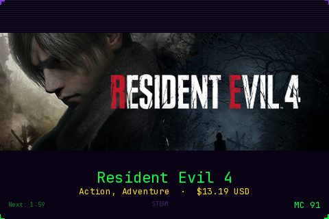
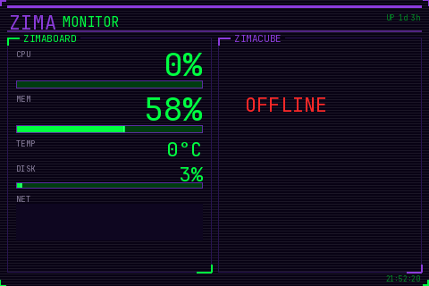
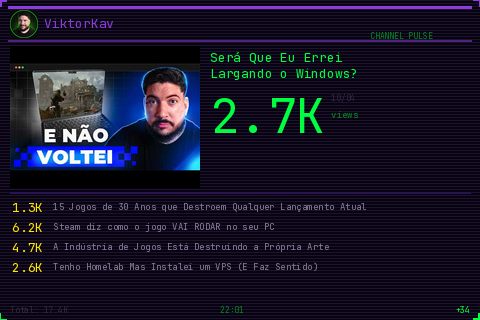
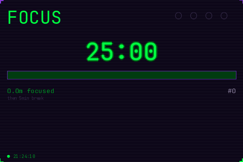

# Zima Screens

5 dashboard screens for a 3.5" USB IPS LCD (320x480, Turing Smart Screen protocol), managed by a web interface.

Built for a ZimaBoard but works on any Linux machine with a compatible USB screen.



## What is this

These cheap 3.5" USB IPS screens (~$15 on AliExpress) don't work as regular monitors. The OS sees them as **serial devices**, and the only way to display anything is by sending raw pixel data over the serial port using code.

This project turns that limitation into a feature: 5 purpose-built screens controlled by a web interface, rendering pixel-perfect layouts with a retro terminal aesthetic.

## The screens

| Screen | What it shows | Data source |
|---|---|---|
| **Zima Monitor** | CPU, MEM, TEMP, DISK, NET sparkline — side-by-side for two devices | `psutil` (local) + ZimaOS API or SSH (remote) |
| **Discord Monitor** | 3 latest messages from a channel, big fonts | Discord Bot API |
| **Channel Pulse** | YouTube channel avatar, subs, latest video with thumbnail, views | YouTube RSS + og:image (no API key needed for most data) |
| **Pomodoro Timer** | Giant countdown, progress bar, cycle dots, focus tracker | Local timer, no external data |
| **Steam Discovery** | Random Steam game every 2 min — fullscreen image with lower third overlay | Steam Store API (no key needed) |

### Screenshots

<table>
<tr>
<td></td>
<td></td>
</tr>
<tr>
<td>Zima Monitor</td>
<td>Channel Pulse</td>
</tr>
<tr>
<td></td>
<td></td>
</tr>
<tr>
<td>Pomodoro Timer</td>
<td>Steam Discovery</td>
</tr>
</table>

## Web controller

A web interface on port 9595 lets you switch between screens, configure the Pomodoro timer, and see a live preview of what's on the LCD.

When switching screens, a retro 8-bit boot animation plays on the LCD (static noise, console boot text with `[OK]` lines, segmented loading bar).

## Setup

### Requirements

- Python 3.8+
- A 3.5" USB LCD (Turing Smart Screen Rev A protocol, chip CH340, serial `USB35INCHIPSV2`)
- A monospace font file (JetBrains Mono recommended — place `JetBrainsMono.ttf` in the project directory)

### Install

```bash
git clone https://github.com/viktorkav/zima-screens.git
cd zima-screens
python3 -m venv venv
source venv/bin/activate
pip install -r requirements.txt
```

### Configure

```bash
cp .env.example .env
# Edit .env with your values (Discord token, YouTube channel ID, etc.)
```

Most screens work without any configuration:
- **Pomodoro** and **Steam Discovery** need zero config
- **Zima Monitor** works in local-only mode without `REMOTE_IP`
- **Channel Pulse** works without an API key (uses RSS for video data)
- **Discord Monitor** needs a bot token and guild ID

### Run

```bash
# Start the web controller (manages all screens)
python3 web_controller.py

# Or run a single screen directly
python3 steam_random.py
python3 pomodoro.py --work 25 --break 5

# Preview mode (saves a PNG instead of sending to the screen)
python3 steam_random.py --preview
```

### Run as a service (systemd)

```ini
# /etc/systemd/system/zima-screens.service
[Unit]
Description=Zima Screens USB LCD Controller
After=network.target

[Service]
Type=simple
WorkingDirectory=/path/to/zima-screens
ExecStart=/path/to/zima-screens/venv/bin/python web_controller.py
Restart=always
RestartSec=5

[Install]
WantedBy=multi-user.target
```

```bash
sudo systemctl enable --now zima-screens
```

### Serial port permissions

The screen appears as `/dev/ttyACM0` (Linux). You may need to add your user to the `dialout` group or create a udev rule:

```bash
# Option 1: add user to dialout
sudo usermod -aG dialout $USER

# Option 2: udev rule for persistent permissions
echo 'SUBSYSTEM=="tty", ATTRS{serial}=="USB35INCHIPSV2", MODE="0666"' | \
  sudo tee /etc/udev/rules.d/99-usb-monitor.rules
sudo udevadm control --reload-rules
```

## How it works

The screen uses the **Turing Smart Screen Revision A** protocol:

1. Open serial at 115200 baud with RTS/CTS hardware flow control
2. Send 6-byte handshake (`0x45` × 6) — screen responds with model ID
3. Build an image (480×320 landscape canvas) with Pillow
4. Rotate 90° to match the screen's native portrait orientation (320×480)
5. Convert pixels to RGB565 (2 bytes/pixel instead of 3)
6. Send bitmap command + pixel data in chunks over serial

Full-screen refresh takes ~1-2 seconds, so expect **~1-2 FPS**. Good enough for dashboards and timers, not for animation or video.

## Project structure

```
shared.py          — Screen driver, palette, fonts, drawing helpers
web_controller.py  — Web interface (port 9595), process manager
zima_monitor.py    — Dual device system monitor
discord_monitor.py — Discord channel messages
channel_pulse.py   — YouTube channel dashboard
pomodoro.py        — Pomodoro focus timer
steam_random.py    — Random Steam game discovery
transition.py      — 8-bit boot animation between screens
```

## Compatible screens

Tested with screens identified as:
- Serial number: `USB35INCHIPSV2`
- Chip: CH340 (Vendor `0x1A86`, Product `0x5722`)
- Protocol: Turing Smart Screen Revision A

These are commonly sold on AliExpress as "3.5 inch USB IPS monitor", "Turing Smart Screen", or "UsbMonitor".

## License

MIT
