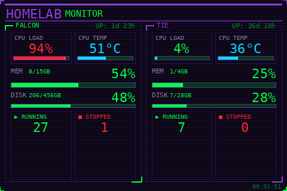

# Homelab Monitor

Dashboard for a 3.5" USB IPS LCD (320x480, Turing Smart Screen protocol) displaying dual-server system stats.

Built for homelab monitoring but works on any Linux/macOS machine with a compatible USB screen.



## What is this

These cheap 3.5" USB IPS screens (~$15 on AliExpress) don't work as regular monitors. The OS sees them as **serial devices**, and the only way to display anything is by sending raw pixel data over the serial port using code.

This project turns that limitation into a feature: a purpose-built dashboard rendering pixel-perfect layouts with a retro terminal aesthetic.

## Project structure

```text
usb-lcd-dashboard/
├── lcd/                    # LCD hardware abstraction layer
│   ├── __init__.py         # Package facade
│   ├── constants.py        # Screen dimensions, colors, protocol commands
│   ├── screen.py           # Serial hardware driver (Screen class)
│   ├── drawing.py          # UI primitives (fonts, panels, bars, sparklines)
│   └── helpers.py          # Formatting utilities (colors, bytes, truncate)
├── homelab_monitor/        # Monitor application logic
│   ├── __init__.py         # Package marker
│   ├── stats.py            # Local system stats (psutil + /proc fallback)
│   ├── remote.py           # Remote stats via SSH
│   └── ui.py               # Dashboard rendering
├── test/                   # Test scripts and archived code
├── screenshots/            # Preview images
├── homelab_monitor.py      # Entry point
├── docker-compose.yml      # Docker services
├── Dockerfile              # Container image
├── .env.example            # Environment variables template
└── pyproject.toml          # Python dependencies
```

## Features

**Homelab Monitor** displays side-by-side stats for two servers:
- **CPU Load & Temperature** — dual panels with color-coded bars
- **Memory** — usage percentage with used/total GB
- **Disk** — usage percentage with used/total GB  
- **Docker Containers** — running/stopped counts
- **Uptime** — days and hours since boot

**Data sources:**
- Local stats via `psutil` (with `/proc` fallback for Debian/OMV)
- Remote stats via SSH (key-based auth required)

### Screenshot

<table>
<tr>
<td></td>
</tr>
<tr>
<td>Homelab Monitor (landscape mode)</td>
</tr>
</table>

## Setup

### Requirements

- Python 3.12+
- A 3.5" USB LCD (Turing Smart Screen Rev A protocol, chip CH340, serial `USB35INCHIPSV2`)
- JetBrains Mono font (place `JetBrainsMono.ttf` in the project directory or install system-wide)
- SSH key-based authentication configured for remote server access (optional)

### Install

```bash
git clone https://github.com/headrockz/usb-lcd-dashboard.git
cd usb-lcd-dashboard
poetry install
```

### Configure

```bash
cp .env.example .env
# Edit .env with your settings
```

Configuration options:
- `REMOTE_IP` — IP of remote server to monitor (leave empty for local-only)
- `REMOTE_SSH_USER` — SSH user for remote access
- `MONITOR_ORIENTATION` — `portrait` or `landscape`
- `SERVER_1_TITLE` / `SERVER_2_TITLE` — custom panel labels
- Color thresholds: `CPU_BAR_RED`, `CPU_BAR_ORANGE`, `USAGE_RED`, `USAGE_ORANGE`, `TEMP_RED`, `TEMP_ORANGE`

### Run

```bash
# Direct execution
poetry run python homelab_monitor.py

# Preview mode (saves PNG instead of sending to screen)
poetry run python homelab_monitor.py --preview
```

### Run with Docker

```bash
# Build and run with docker-compose
docker compose up -d --build

# Or build manually
docker build -t homelab-monitor .
docker run -d \
  --name homelab-monitor \
  --device /dev/ttyACM0:/dev/ttyACM0 \
  -v ~/.ssh/id_ed25519:/root/.ssh/id_ed25519:ro \
  -v ~/.ssh/known_hosts:/root/.ssh/known_hosts:ro \
  --env-file .env \
  homelab-monitor
```

### Serial port permissions

The screen appears as `/dev/ttyACM0` (Linux). You may need to add your user to the `dialout` group or create a udev rule:

```bash
# Option 1: add user to dialout
sudo usermod -aG dialout $USER

# Option 2: udev rule for persistent permissions
echo 'SUBSYSTEM=="tty", ATTRS{serial}=="USB35INCHIPSV2", MODE="0666"' | \
  sudo tee /etc/udev/rules.d/99-usb-monitor.rules
sudo udevadm control --reload-rules
```

## How it works

The screen uses the **Turing Smart Screen Revision A** protocol:

1. Open serial at 115200 baud with RTS/CTS hardware flow control
2. Send 6-byte handshake (`0x45` × 6) — screen responds with model ID
3. Build an image (480×320 landscape canvas) with Pillow
4. Rotate 90° to match the screen's native portrait orientation (320×480)
5. Convert pixels to RGB565 (2 bytes/pixel instead of 3)
6. Send bitmap command + pixel data in chunks over serial

Full-screen refresh takes ~1-2 seconds, so expect **~1-2 FPS**. Good enough for dashboards and timers, not for animation or video.

## Compatible screens

Tested with screens identified as:
- Serial number: `USB35INCHIPSV2`
- Chip: CH340 (Vendor `0x1A86`, Product `0x5722`)
- Protocol: Turing Smart Screen Revision A

These are commonly sold on AliExpress as "3.5 inch USB IPS monitor", "Turing Smart Screen", or "UsbMonitor".

## License

MIT
